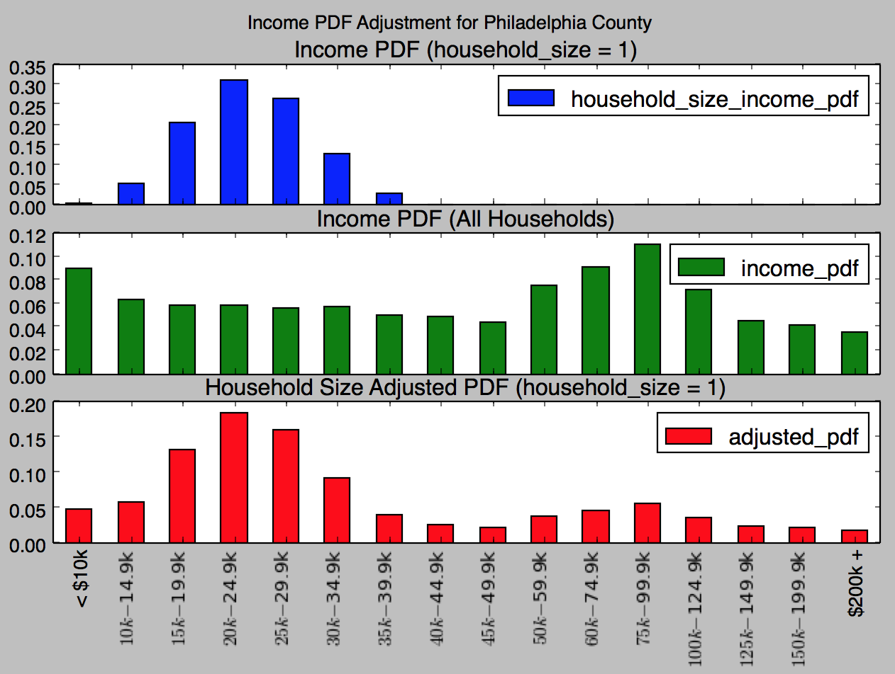
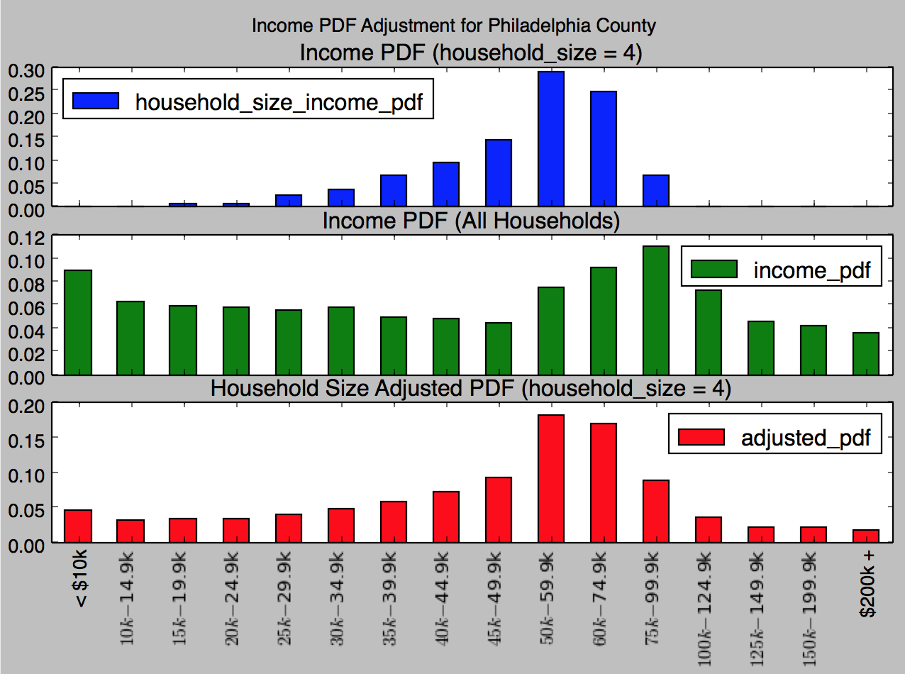

# Estimating Local SNAP Eligibility using Monte-Carlo Methods

```
Simulating 233066 households for Bucks County
100%|███████████████████████████████████████| 233066/233066 [00:39<00:00, 11925.22it/s]
Simulated 233066 households
SNAP ELIGIBLE INDIVIDUALS: 348288
````

## Objective
Estimate the eligible but not enrolled population by zipcode, county, and congressional district using publicly available data.

## Method
There are three questions that dictate whether you might be eligible for SNAP in PA:

1. How many people live in your household?
2. What is your gross monthly income?
3. Is anyone elderly or disabled in your household?

The information is gathered by the US Census Bureau down to the zipcode level in the [American Community Survey](https://www.census.gov/data/developers/data-sets/acs-1year.html). This project uses data in the ACS to simulate the three dimensions above. By simulating these dimensions, rough estimation for eligibility can be computed.

Using Monte-Carlo methods using _randomness_ derived from US Census data, SNAP eligibility estimates are generated based on local household size, income, and households with elderly or disabled individuals.

### Probability Density Functions (PDFs)
A series of PDFs are used to randomly generate a sample of households. Each simulated household is assigned a size (1-7 person households), an income (0 - $200k), and either has or does not have an elderly or disabled household member. Using the US Census data, we created three PDFs, one for each of the three questions that influence SNAP eligibility.

:warning: Currently assumes that these PDFs are independent of each other. In reality, household size actually influences income and elderly/disabled. This is represented in the US Census data and can be factored into the simulation later.

#### Calculating Households Sizes
In each locality, we can get the number of total number of households by number of household members. From these numbers, we can compute a PDF (sample shown below in **Dist** plot).

| Philadelphia Household Size PDF | Bucks Household Size PDF |
| --- |---|
| {:height="250px" width="250px"} | {:height="250px" width="250px"} |

#### Calculating Incomes
In each locality, we can get the number of total number of households by income (in 16 buckets < $10k to > $200k). From these numbers, we can compute a PDF (sample shown below in **Dist** plot).

This presents a challenge because we only have certain data for income by household size. Without factoring in the impact of household size on income in the simulation, the final estimates of SNAP eligibility seem unreasonably high when compare to previous snap participation rates ([Cunnyngham, K et al, 2009](https://www.mathematica-mpr.com/-/media/publications/pdfs/nutrition/fns09rates.pdf)). This simulation is in `simulation_1.py`.

##### Factoring in Household Size to Income
:construction: Work in progress
US Census data provides _median household income by household size_ (B19019). Using methods for estimating standard deviation, this simulation seeks to more accurately simulate SNAP eligibility. US Census data also provides _total households by income buckets_ (B19101) using 16 income buckets (see `simulator.INCOMES` in `simulator.py`).

This method will use the median income by household size as a seed to adjust the probability distribution function derived from US Census data (example below). These PDFs vary by county, zipcode, and congressional district.

| Philadelphia Income PDF | Bucks Income PDF |
| --- |---|
| {:height="200px" width="200px"} | {:height="200px" width="200px"} |

These PDFs are adjusted by summing them with a normally distributed probability density function derived for each household size (see `household_size_pdfs.py`). Using the _median_ from US Census data and an _assumed standard deviation_ (std = $200k / 6 = $30k), this method sums the two PDFs together and normalizes them into a _household size adjusted income probability distribution function_.

Figures below should this household size income adjustment in Philadelphia county. This effectively lowers the number of larger (2+ person) households eligible for SNAP since larger households tend to make more income as demonstrated by a larger median income.

| 1-person Household Income Adjusted PDF | 4-person Household Income Adjusted PDF  |
| --- |---|
| {:height="200px" width="200px"} | {:height="200px" width="200px"} |


#### Calculating Elderly/Disabled
:warning: Not currently factoring this into the simulation.

## US Census Data: American Community Survey Resources
* [American Community Survey 1-Year Data (2011-2016)](https://www.census.gov/data/developers/data-sets/acs-1year.html)
* [Variable Definitions](https://api.census.gov/data/2016/acs/acs1/variables.html)
* [Python wrapper for the US Census API](https://github.com/datamade/census)
