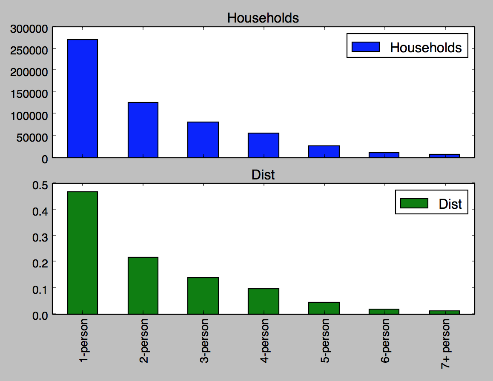
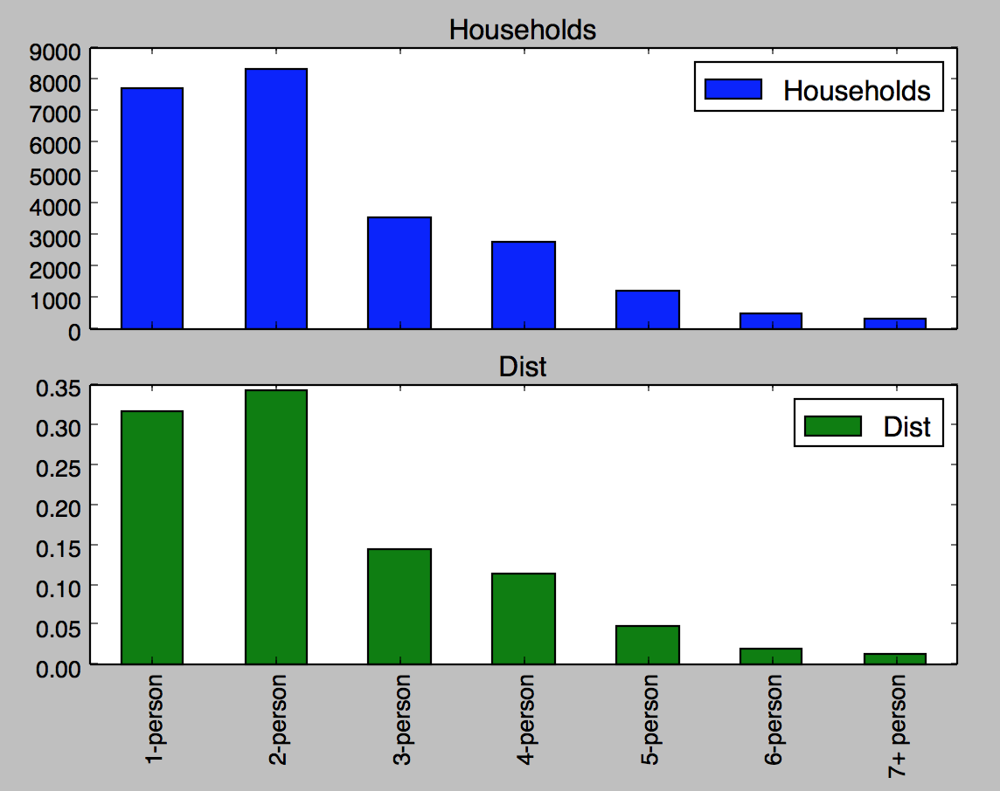
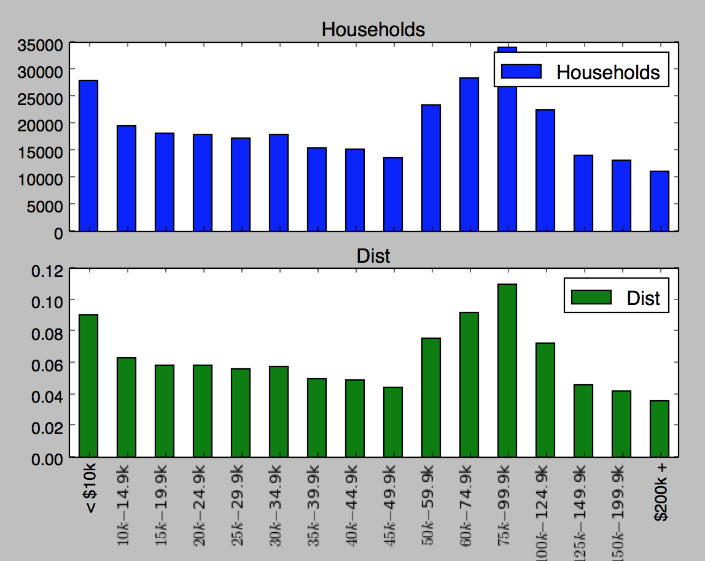
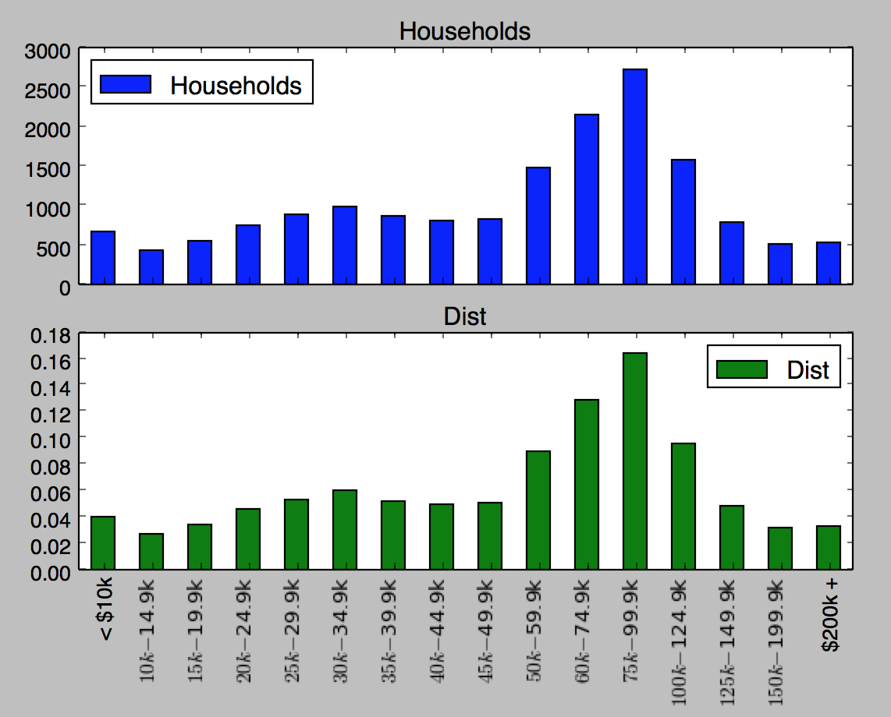

# Estimating Local SNAP Eligibility using Monte-Carlo Methods in Pennsylvania

## Objective
Estimate the eligible but not enrolled population by zipcode, county, and congressional district using publicly available data.

## Method
There are three questions that dictate whether you might be eligible for SNAP in PA:

1. How many people live in your household?
2. What is your gross monthly income?
3. Is anyone elderly or disabled in your household?

The information is gathered by the US Census Buearu down to the zipcode level in the [American Community Survey](https://www.census.gov/data/developers/data-sets/acs-1year.html). This project uses data in the ACS to simulate the three dimensions above. By simulating these dimensions, rough estimation for eligibility can be computed.

Using Monte-Carlo methods and probability density functions derived from US Census data, estimates are based on local differences and provide a more detailed view than existing SNAP eligibility estimates provide.

### Probability Density Functions (PDFs)
A series of PDFs are used to randomly generate a sample of households. Each simulated household is assigned a size (1-7 person households), an income (0 - $200k), and either has or does not have an elderly or disabled household member. Using the US Census data, we created three PDFs, one for each of the three questions that influence SNAP eligibility.

:warning: Currently assumes that these three PDFs are independent of each other. In reality, household size actually influences income and elderly/disabled.

#### Calculating Households Sizes
In each locality, we can get the number of total number of households by number of household members. From these numbers, we can compute a PDF.

| Philadelphia Household Size PDF | Bucks Household Size PDF |
| --- |---|
| {:height="250px" width="250px"} | {:height="250px" width="250px"} |

#### Calculating Incomes
In each locality, we can get the number of total number of households by income (in 16 buckets < $10k to > $200k). From these numbers, we can compute a PDF.

| Philadelphia Household Size PDF | Bucks Household Size PDF |
| --- |---|
| {:height="250px" width="250px"} | {:height="250px" width="250px"} |

#### Calculating Elderly/Disabled
